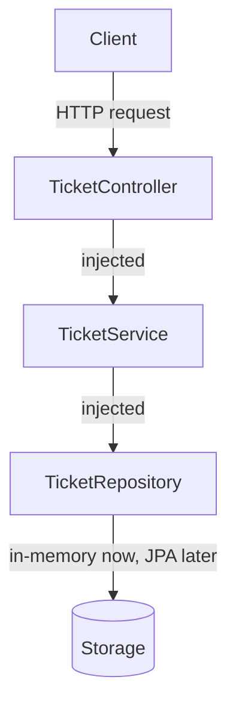

# Bastion

A REST API for managing support tickets, built with Spring Boot, as a
learning project coming from an Erlang/OTP backend background.

## About

Bastion is a small support-ticket system (similar in spirit to a minimal
Zendesk or Jira Service Desk). It exists to build real, working knowledge
of Java and Spring Boot incrementally — starting from environment setup,
through layered architecture, dependency injection, and persistence —
rather than generating a finished app from a tutorial.

## Domain

- **User**: a person who can create tickets. Fields: `id`, `name`, `email`.
- **Ticket**: a support request created by a user. Fields: `id`, `title`,
  `description`, `status`, `createdAt`, and a reference to the owning user.

Status flow: `OPEN` -> `IN_PROGRESS` -> `CLOSED`

## Architecture

Layers, top to bottom:
- **Controller**: handles HTTP only, no business logic.
- **Service**: business logic (creating tickets, changing status, rules).
- **Repository**: data access, currently an in-memory list, later a real
  database via Spring Data JPA.

Each layer depends on the one below it via **dependency injection**
(Spring provides the instance; layers don't construct their own
dependencies with `new`).

## Features

- [x] Project setup with Spring Initializr (Java 21 LTS, Maven, Spring Web)
- [x] First `@RestController` responding over HTTP
- [x] Git + GitHub connected
- [x] `User` entity
- [x] `Ticket` entity, with `status` as an enum
- [x] `TicketService` with in-memory storage
- [x] `TicketController` using the service via dependency injection
- [x] Manual testing with curl / browser
- [ ] Unit tests
- [ ] Persistence with Spring Data JPA
- [ ] `UserController`
- [ ] Authentication (stretch goal)

## Roadmap

1. `User` entity (plain fields, constructor, getters/setters)
2. `Ticket` entity, including its relationship to `User` and the `status` enum
3. `TicketService` with in-memory storage, wired via dependency injection
4. `TicketController` consuming the service (no logic in the controller)
5. Manual testing (curl / browser)
6. Unit tests for the service layer
7. Persistence with Spring Data JPA + a real database
8. `UserController` and remaining CRUD endpoints
9. Stretch: basic authentication

## Tech stack

- Java 21 (LTS)
- Spring Boot 4.1
- Maven
- In-memory storage for now; JPA planned later.

## Future project: resilience & scale

A separate project, planned for after `bastion` reaches persistence (JPA),
to explore concepts that don't map 1:1 from Erlang/OTP to the JVM world:

- **High availability**: multiple instances behind a load balancer, health
  checks, instead of OTP supervisor trees.
- **Circuit breakers**: Resilience4j, as the JVM equivalent of failure
  isolation (a different mechanism than OTP's "let it crash").
- **High transaction throughput**: connection pooling, caching (Redis),
  Java 21 virtual threads.
- **Horizontal scaling**: stateless instances, Docker, possibly Kubernetes.
- **Zero-downtime deploys**: rolling / blue-green deployments — note this
  is deployment orchestration, NOT the same as OTP hot code swapping
  (`code:load_file/1`). The JVM has no direct equivalent for swapping code
  in a live process without a restart; "zero downtime" here means the
  *user* never sees downtime because other instances keep serving while
  one restarts.

Not started yet. Revisit once `bastion` has a working persistence layer.